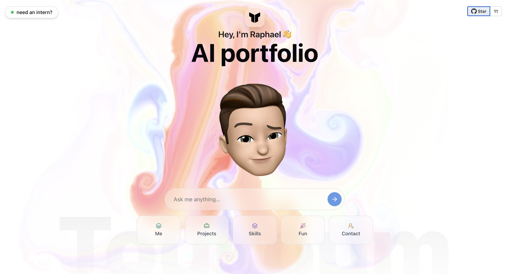

<!--  -->
 
# World's first AI portfolio 🤖✨  

**Static portfolios are dead.**  
So I built [https://aiportfolio.vercel.app](This).

Instead of making you scroll endlessly, my portfolio adapts to *you*.  
Ask a question — my AI avatar replies instantly.

## 👇 What can you ask?

- 🧠 **Tech recruiter?** Ask about my stack & results  
- 💻 **Dev?** Dive into my code & mindset  
- 🧑‍🤝‍🧑 **Friend or family?** See what I've been working on  

---

This is not a portfolio.  
It's a **conversation tailored to your curiosity**.

➡️ **Try it now:** [https://aiportfolio.vercel.app](Live Demo)  
*What will you ask?*

## 🚀 How to run

Want to run this project locally? Here's what you need:

### Prerequisites
- **Node.js** (v18 or higher)
- **pnpm** package manager
- **Google Gemini API key** (for AI chat functionality)
- **GitHub token** (for GitHub integration features)

### Setup
1. **Clone the repository**
   ```bash
   git clone <your-repo-url>
   cd aiportfolio
   ```

2. **Install dependencies**
   ```bash
   pnpm install
   ```

3. **Environment variables**
   Create a `.env.local` file in the root directory:
   ```env
   GEMINI_API_KEY=your_gemini_api_key_here
   GITHUB_TOKEN=your_github_token_here
   ```

4. **Run the development server**
   ```bash
   pnpm dev
   ```

5. **Open your browser**
   Navigate to `http://localhost:3000`

### Getting your **tokens**
- **Google Gemini API Key**: Get it from [ai.google.dev](https://ai.google.dev/)
- **GitHub Token**: Generate one at [github.com/settings/tokens](https://github.com/settings/personal-access-tokens) with repo access

## 🌟 Cool features to add

- **Voice interaction**: Allow visitors to speak with your AI avatar using the Web Speech API
- **Multi-language support**: Automatically detect and respond in the visitor's language
- **Personalized recommendations**: Suggest specific projects based on visitor's interests
- **Real-time collaboration**: Allow the AI to pair-program with visitors on a simple coding challenge
- **Dynamic theme switching**: Let visitors customize the portfolio's appearance
- **Calendar integration**: Enable scheduling meetings directly from the chat interface
- **Analytics dashboard**: Track popular questions and visitor engagement patterns

#### 🔖 Tags

`#AIPortfolio` `#InnovationInTech` `#DigitalResume` `#JobSearch` `#TechInnovation` `#WebDevelopment` `#FutureTech` `#GoogleGemini`